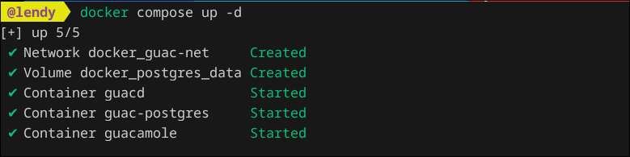
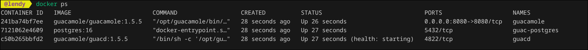
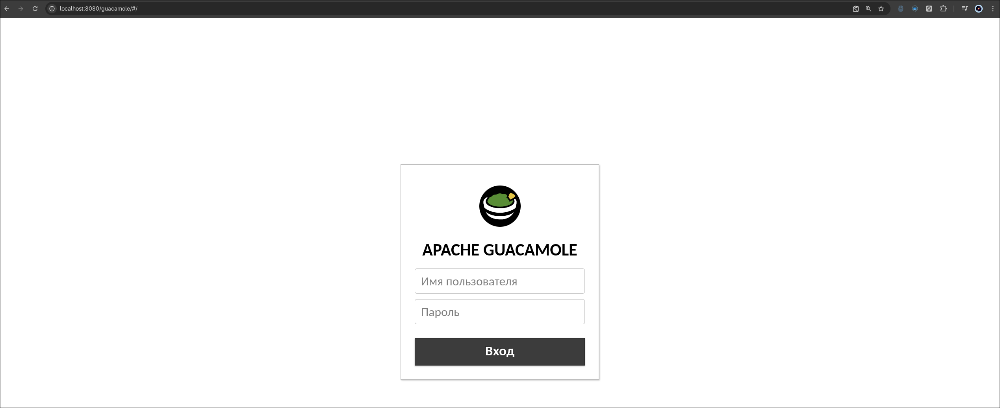
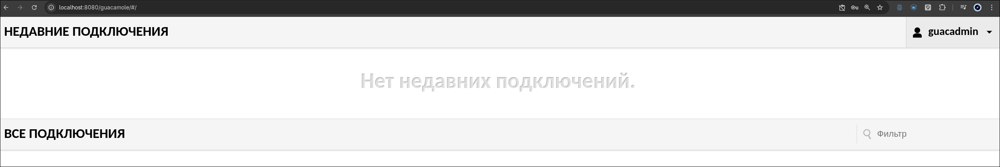
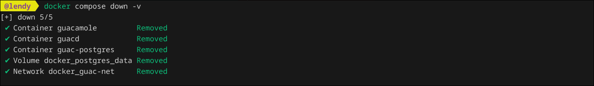
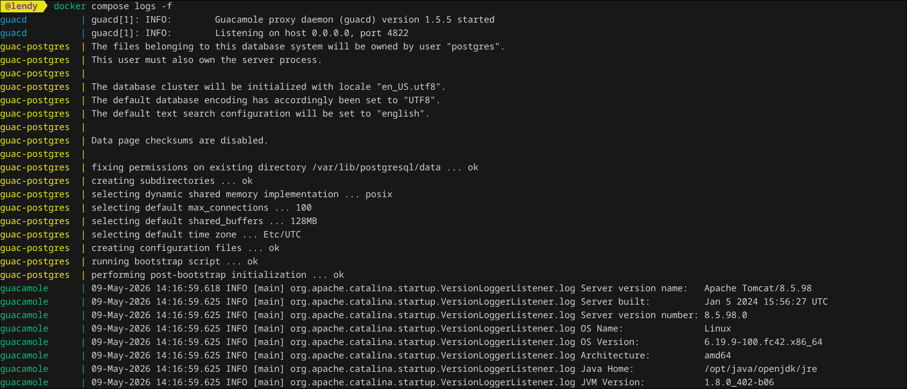

# Apache Guacamole Docker Setup

Docker Compose конфигурация для запуска Apache Guacamole с PostgreSQL.

## Что это

Apache Guacamole — это web-based remote desktop gateway.

Поддерживает:
- RDP
- SSH
- VNC

Доступ к серверам осуществляется через браузер без установки дополнительных клиентов.

---

# Стек

- Apache Guacamole
- PostgreSQL
- Docker Compose

---

# Структура проекта

```text
.
├── docker-compose.yml
├── .env
├── .env.example
└── init/
    └── initdb.sql
└── scr/
    └── image01.png
    └── ...
```

---

# Подготовка

## 1. Скопировать env

```bash
cp .env.example .env
```

## 2. Изменить пароль

Отредактировать `.env`:

```env
POSTGRES_PASSWORD=your_secure_password
```

---

# Инициализация БД

Сгенерировать schema:

```bash
docker run --rm guacamole/guacamole:1.5.5 \
  /opt/guacamole/bin/initdb.sh --postgresql > init/initdb.sql
```

---

# Запуск

```bash
docker compose up -d
```


Проверка контейнеров:

```bash
docker ps
```


---

# Доступ

Web UI:

```text
http://localhost:8080/guacamole/
```



или:

```text
http://SERVER_IP:8080/guacamole/
```

---

# Стандартный логин

```text
Username: guacadmin
Password: guacadmin
```



После первого входа рекомендуется сменить пароль.

---

# Остановка

```bash
docker compose down #(удаление контейнеров с флагом -v)
```



---

# Полезные команды

Логи:

```bash
docker compose logs -f
```



Перезапуск:

```bash
docker compose restart
```
